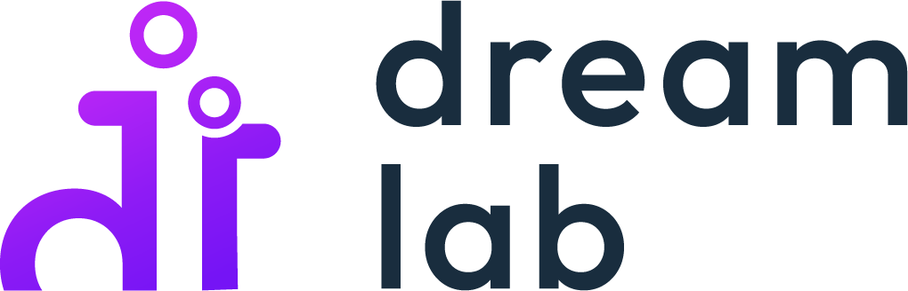
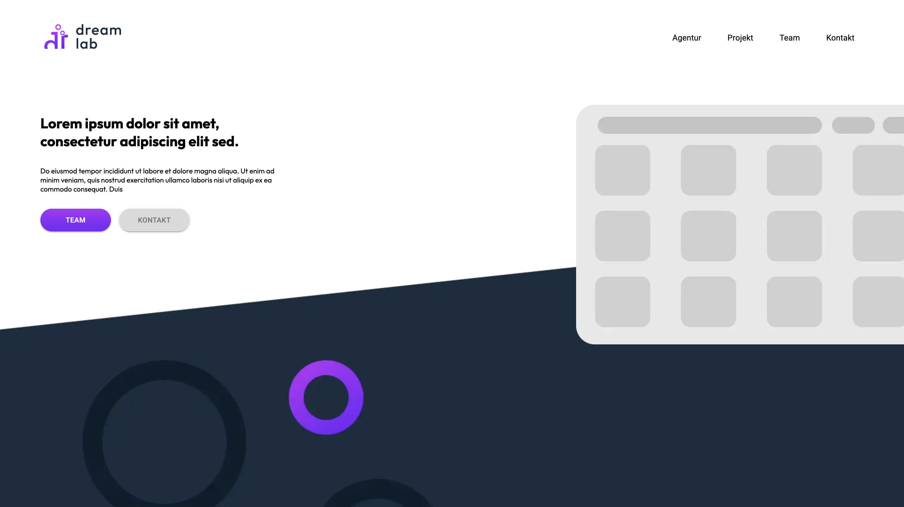

 
  

&#xa0;
<h2 align="center">dream lab Agency</h2>

&#xa0;

&#xa0;

 

  <a href="#dart-about">About</a> &#xa0; | &#xa0; 
  <a href="#white_check_mark-screenshots">Screenshots</a> &#xa0; | &#xa0;
  <a href="#rocket">Technology</a> &#xa0; | &#xa0;
  <a href="#checkered_flag-information">Information</a> &#xa0; | &#xa0;
  <a href="#memo-license">License</a> &#xa0; | &#xa0;
  <a href="https://github.com/sarcan" target="_blank">Author</a>

 

## :dart: About

This is part of a bachelor project on behalf of the SAE Institute in Zurich.

Get to know our Agency Dream Lab and our vision for a tight-knit local community. 

## :white_check_mark: Screenshots

## :rocket: Technology

The following tools were used in this project:

- [Next.js](https://nextjs.org/)
- [TypeScript](https://www.typescriptlang.org/)
- [React](https://reactjs.org/)

## :checkered_flag: Information

Before starting ✅, you need to have [Git](https://git-scm.com) and [Node](https://nodejs.org/en/) installed.
Install all dependencies with npm init. Check package.json to see what the dependencies are.

## :memo: License

This project is under license from MIT.

  
Made with ❤️

  
Hadrian Chio

  
Sarah Candolfi

  
Jasmin Fischli

  
Fiona Hilpertshauser

  
Nikola Vucic

  
Claudio Mühle

  
Manuela Pfister

  
Michel Weber

&#xa0;

<a href="#top">Back to top</a>

